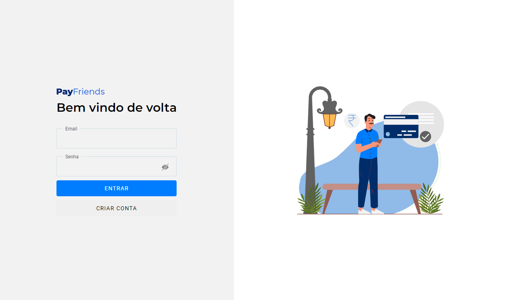

<h1 align=center>Payments Dashboard (Angular)</h1>

Aplicação de listagem de pagamentos (CRUD) com login com autenticação de usuário, com tabela de itens, paginação, filtragem e página de perfil.

<h3 align=center>

💻 **Acesse a aplicação [aqui](https://dxwebster.github.io/picpay-desafio-frontend/)**

</h3>

<h5 align=center>
 

</h5>

## 🛠 Tecnologias utilizadas

-  angular
-  angular material
-  angular animation
-  json-server
-  ngx-order-pipe
-  ngx-pagination
-  sass

## ✨ Features implementadas:

### Página de Login
- Formulário para autenticação do usuário
- Validação email e senha
- Ícone para ocultar e exibir senha
- Toasts para login success (user autenticado)
- Toast de login error (credenciais inválidas)

### Página Dashboard
- Acesso restrito para usuário autenticado
- Modal de Adicionar pagamento
- Tabela com dados de pagamento
- Ordenação das colunas da tabela
- Search por nome de usuário
- Paginação da tabela
- Botões Editar e Excluir pagamento
- Toasts para resultado de ações do dashboard (error e success)

### Página de Perfil
- Acesso restrito para usuário autenticado
- Visualização de dados do usuário
- Edição de dados do usuário
- Página de Cadastro
- Formulário para cadastrar novo usuário
- Validação de dados não preenchidos e email inválido
- Header
- Navegação para páginas da aplicação (Pagamentos e Perfil)
- Botão sair

## 🚧 Melhorias necessárias:

1. Página de Perfil
- Atual: é necessário fazer logout para atualizar os dados do usuário editados na página de perfil
- Melhoria: atualização dos dados assim que dá o submit no form

2. Modal de Adicionar Pagamento
- Atual: se o user não preencher nenhum dado no modal, ao dar submit aparece erro e não cria novo pagamento
- Melhoria: Validação dos inputs do formulário antes do submit (favor não preencher o campo "valor" com string só com number pra não quebrar o search)

3. Ação deletar pagamento
- Atual: Ao clique do botão, o pagamento é automaticamente excluído da base
- Melhoria: Mostrar dialog pedindo confirmação para excluir pagamento

4. Botão sair
- Atual: Ao clique do botão, o usuário é automaticamente deslogado da aplicação
- Melhoria: Mostrar dialog pedindo confirmação para deslogar

## 🛠 Setup do projeto

- Angular CLI: 12.1.4
- Node: 12.20.2
## 📥 Como Rodar?

- Clonar Repositório: `git clone https://github.com/dxwebster/payments-dashboard`
- Instalar dependências: `npm install`
- Executar `ng serve` para iniciar o servidor de desenvolvimento.
- A aplicação estará disponível na porta `http://localhost:4200/`

## Deploy no GithubPages

- Instalar a cli do github pages para angular `ng add angular-cli-ghpages`
- Executar `ng deploy` para fazer a build em produção automaticamente
- Aguardar um pouco para o github pages atualizar

## 📕 Licença

Todos os arquivos incluídos aqui, incluindo este _Readme_, estão sob Licença MIT. 
Criado com ❤ por [Adriana Lima](https://github.com/dxwebster)
